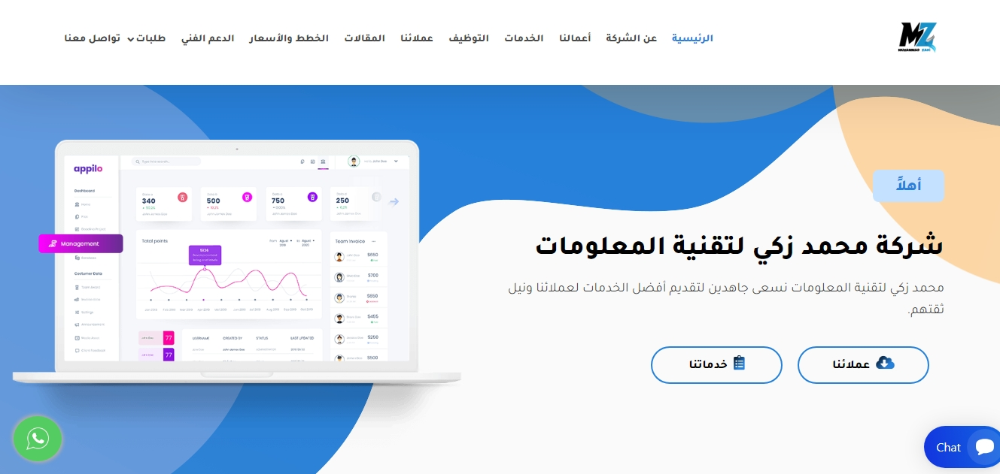

# mz-tech



<p>مشروع احترافي متكامل بإطار العمل Vue.js</p>
<p>فكرة المشروع Startup Website كامل و Responsive لعرض خدمات و أعمال الشركة مع امكانية التواصل و تقديم المقترحات و استلام الدعم الفني</p>
<p>استخدم لعمل المشروع: CSS, JavaScript, jQuery, Sass, Bootstrap, Vue.js, Vue Router, Pinia for State Management</p>

## Project Setup

```sh
npm install
```

### Compile and Hot-Reload for Development

```sh
npm run dev
```

### Compile and Minify for Production

```sh
npm run build
```

### Lint with [ESLint](https://eslint.org/)

```sh
npm run lint
```
